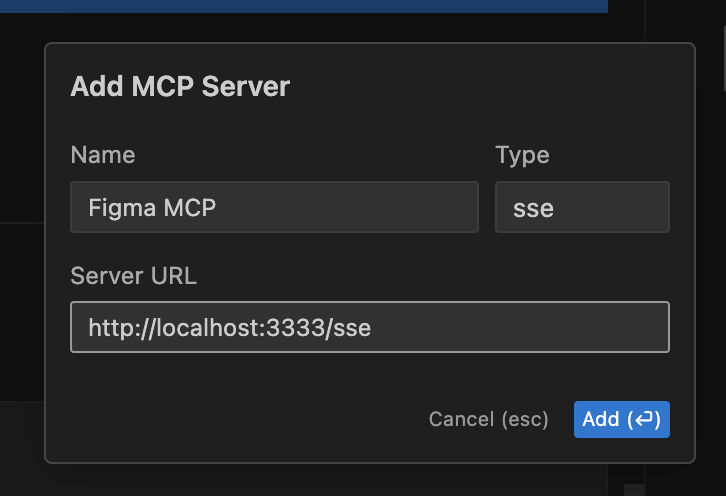
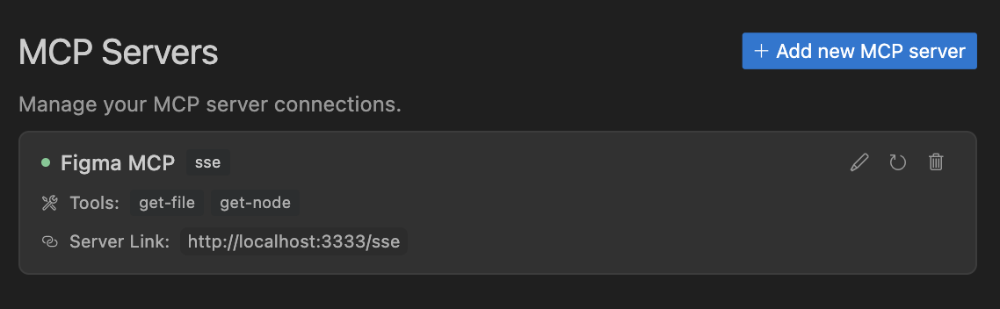
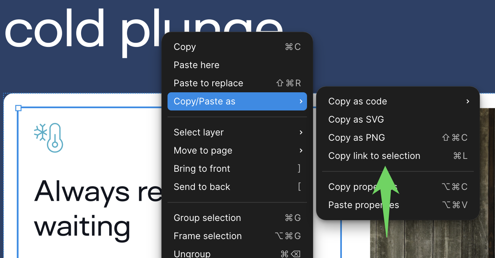

# Figma MCP Server

Give [Cursor](https://cursor.sh/), [Windsurf](https://codeium.com/windsurf), [Cline](https://cline.bot/), and other AI-powered coding tools access to your Figma files with this [Model Context Protocol](https://modelcontextprotocol.io/introduction) server.

When Cursor has access to Figma design data, it's **way** better at one-shotting designs accurately than alternative approaches like pasting screenshots.

Get started quickly, see [Configuration](#configuration) for more details:

```bash
npx figma-developer-mcp --figma-api-key=<your-figma-api-key>
```

## Demo Video

[Watch a demo of building a UI in Cursor with Figma design data](https://youtu.be/6G9yb-LrEqg)
[](https://youtu.be/6G9yb-LrEqg)

<a href="https://glama.ai/mcp/servers/kcftotr525"></a>

## How it works

1. Open Cursor's composer in agent mode.
1. Paste a link to a Figma file, frame, or group.
1. Ask Cursor to do something with the Figma file—e.g. implement a design.
1. Cursor will fetch the relevant metadata from Figma and use it to write your code.

This MCP server is specifically designed for use with Cursor. Before responding with context from the [Figma API](https://www.figma.com/developers/api), it simplifies and translates the response so only the most relevant layout and styling information is provided to the model.

Reducing the amount of context provided to the model helps make the AI more accurate and the responses more relevant.

## Installation

### Running the server quickly with NPM

You can run the server quickly without installing or building the repo using NPM:

```bash
npx figma-developer-mcp --figma-api-key=<your-figma-api-key>

# or
pnpx figma-developer-mcp --figma-api-key=<your-figma-api-key>

# or
yarn dlx figma-developer-mcp --figma-api-key=<your-figma-api-key>

# or
bunx figma-developer-mcp --figma-api-key=<your-figma-api-key>
```

Instructions on how to create a Figma API access token can be found [here](https://help.figma.com/hc/en-us/articles/8085703771159-Manage-personal-access-tokens).

### JSON config for tools that use configuration files

Many tools like Windsurf, Cline, and [Claude Desktop](https://claude.ai/download) use a configuration file to start the server.

The `figma-developer-mcp` server can be configured by adding the following to your configuration file:

```json
{
  "mcpServers": {
    "figma-developer-mcp": {
      "command": "npx",
      "args": ["-y", "figma-developer-mcp", "--stdio"],
      "env": {
        "FIGMA_API_KEY": "<your-figma-api-key>"
      }
    }
  }
}
```

### Running the server from local source

1. Clone the [repository](https://github.com/GLips/Figma-Context-MCP)
2. Install dependencies with `pnpm install`
3. Copy `.env.example` to `.env` and fill in your [Figma API access token](https://help.figma.com/hc/en-us/articles/8085703771159-Manage-personal-access-tokens). Only read access is required.
4. Run the server with `pnpm run dev`, along with any of the flags from the [Command-line Arguments](#command-line-arguments) section.

## Configuration

The server can be configured using either environment variables (via `.env` file) or command-line arguments. Command-line arguments take precedence over environment variables.

### Environment Variables

- `FIGMA_API_KEY`: Your [Figma API access token](https://help.figma.com/hc/en-us/articles/8085703771159-Manage-personal-access-tokens) (required)
- `PORT`: The port to run the server on (default: 3333)

### Command-line Arguments

- `--version`: Show version number
- `--figma-api-key`: Your Figma API access token
- `--port`: The port to run the server on
- `--stdio`: Run the server in command mode, instead of default HTTP/SSE
- `--help`: Show help menu

## Connecting to Cursor

### Start the server

```bash
> npx figma-developer-mcp --figma-api-key=<your-figma-api-key>
# Initializing Figma MCP Server in HTTP mode on port 3333...
# HTTP server listening on port 3333
# SSE endpoint available at http://localhost:3333/sse
# Message endpoint available at http://localhost:3333/messages
```

### Connect Cursor to the MCP server

Once the server is running, [connect Cursor to the MCP server](https://docs.cursor.com/context/model-context-protocol) in Cursor's settings, under the features tab.



After the server has been connected, you can confirm Cursor's has a valid connection before getting started. If you get a green dot and the tools show up, you're good to go!



### Start using Composer with your Figma designs

Once the MCP server is connected, **you can start using the tools in Cursor's composer, as long as the composer is in agent mode.**

Dropping a link to a Figma file in the composer and asking Cursor to do something with it should automatically trigger the `get_file` tool.

Most Figma files end up being huge, so you'll probably want to link to a specific frame or group within the file. With a single element selected, you can hit `CMD + L` to copy the link to the element. You can also find it in the context menu:



Once you have a link to a specific element, you can drop it in the composer and ask Cursor to do something with it.

## Inspect Responses

To inspect responses from the MCP server more easily, you can run the `inspect` command, which launches the `@modelcontextprotocol/inspector` web UI for triggering tool calls and reviewing responses:

```bash
pnpm inspect
# > figma-mcp@0.1.8 inspect
# > pnpx @modelcontextprotocol/inspector
#
# Starting MCP inspector...
# Proxy server listening on port 3333
#
# 🔍 MCP Inspector is up and running at http://localhost:5173 🚀
```

## Available Tools

The server provides the following MCP tools:

### get_figma_data

Fetches information about a Figma file or a specific node within a file.

Parameters:

- `fileKey` (string, required): The key of the Figma file to fetch, often found in a provided URL like `figma.com/(file|design)/<fileKey>/...`
- `nodeId` (string, optional, **highly recommended**): The ID of the node to fetch, often found as URL parameter node-id=<nodeId>
- `depth` (number, optional): How many levels deep to traverse the node tree, only used if explicitly requested by you via chat

### download_figma_images (work in progress)

Download SVG and PNG images used in a Figma file based on the IDs of image or icon nodes.

Parameters:

- `fileKey` (string, required): The key of the Figma file containing the node
- `nodes` (array, required): The nodes to fetch as images
  - `nodeId` (string, required): The ID of the Figma image node to fetch, formatted as 1234:5678
  - `imageRef` (string, optional): If a node has an imageRef fill, you must include this variable. Leave blank when downloading Vector SVG images.
  - `fileName` (string, required): The local name for saving the fetched file
- `localPath` (string, required): The absolute path to the directory where images are stored in the project. Automatically creates directories if needed.

# Figma 정보 요청 화면 컴포넌트

이 프로젝트는 Figma 디자인을 기반으로 정보 요청 화면 컴포넌트를 구현한 React 애플리케이션입니다.

## 기능

- 체크 아이콘 표시
- 회사명이 강조된 안내 메시지 표시

## 설치 및 실행

### 의존성 설치

```bash
# npm 사용
npm install

# 또는 pnpm 사용
pnpm install
```

### 개발 서버 실행

```bash
# npm 사용
npm run dev:web

# 또는 pnpm 사용
pnpm dev:web
```

### 빌드

```bash
# npm 사용
npm run build:web

# 또는 pnpm 사용
pnpm build:web
```

## 프로젝트 구조

```
public/
  ├── images/
  │   └── checkCircle.svg
  └── index.html
src/
  └── components/
      ├── App.tsx
      ├── CheckCircle.tsx
      ├── Header.tsx
      ├── InfoRequestScreen.tsx
      └── index.tsx
```

## 기술 스택

- React
- TypeScript
- Tailwind CSS
- Webpack

## Figma 디자인

이 프로젝트는 다음 Figma 디자인을 기반으로 구현되었습니다:
[Figma 디자인 링크](https://www.figma.com/design/z5fANFNRnproZqtfdPuLm8/%5B%EC%8B%9C%EC%A6%8C11%5D-%EB%A7%9E%EC%B6%A4%EB%B6%84%EC%84%9D?node-id=4805-47890&m=dev)
